# Election Polling Aggregator

[](https://www.python.org/)
[](https://pandas.pydata.org/)
[](https://scikit-learn.org/)
[](https://github.com/fahadamjad009/election-polling-aggregator/actions/workflows/ci.yml)
[](data/model/final_holdout/HOLDOUT_EVALUATED.lock)
[](LICENSE)
[](https://election-polling-aggregator.streamlit.app)

> A reproducible historical election-polling pipeline covering 22 national elections across Australia, Canada, the United Kingdom, and the United States, with explicit national-scope governance, leakage-safe model selection, and a locked chronological holdout.

The project predicts national vote share and the national polling leader. It deliberately does not claim to predict seats, constituencies, electoral-college outcomes, coalition formation, or government formation.

Streamlit Community Cloud application - https://election-polling-aggregator.streamlit.app/
---

## Headline results

| Evaluation | Elections | MAE | RMSE | Winner accuracy |
|---|---:|---:|---:|---:|
| Development leave-one-election-out validation | 14 | **1.3115 pp** | **1.7230 pp** | **92.9%** |
| Locked chronological holdout | 8 | **1.2435 pp** | **1.6799 pp** | **87.5%** |

The selected method is the **final five-observation rolling polling average**. More complex ridge-regression challengers did not improve vote-share error, so the simpler and more defensible benchmark was retained.

The final holdout correctly identified the polling leader in **7 of 8 elections**. The single missed winner was **Australia 2019**.

---

## Why this project exists

Historical election polling is difficult to compare reliably across countries because source pages mix national polls with regional tables, constituency estimates, approval ratings, election-result markers, historical comparisons, and differently structured party labels.

This project treats those issues as data-governance and validation problems rather than assuming every scraped table is suitable for modelling.

The pipeline demonstrates:

- reproducible acquisition and country-specific normalisation;
- explicit national polling-scope controls;
- documented automatic and manual inclusion decisions;
- election-date cutoffs that prevent post-election leakage;
- development-only model selection;
- a chronological holdout evaluated once and then locked;
- auditable intermediate datasets and evaluation artifacts.

---

## Architecture

```mermaid
flowchart LR
    A[Historical polling sources] --> B[Raw polling tables]
    R[Official election results] --> C[Country-specific cleaning]
    B --> C
    C --> D[Canonical polling and results]
    D --> E[National-scope audit]
    O[Manual override register] --> E
    E --> F[Approved national polling tables]
    F --> G[Election-date cutoff]
    G --> H[Rolling averages and features]
    H --> I[Party-election modelling dataset]
    I --> J[Development elections]
    I --> K[Chronological holdout]
    J --> L[Baselines, ablation and error analysis]
    L --> M[Method selection locked]
    M --> N[Single final holdout evaluation]
    K --> N
    N --> P[Metrics, predictions and audit evidence]
```



The full architecture rationale is documented in [`docs/ARCHITECTURE.md`](docs/ARCHITECTURE.md).

---

## Repository structure

```text
election-polling-aggregator/
|-- data/
|   |-- australia/                 # Australia historical election inputs
|   |-- canada/                    # Canada riding-level election inputs
|   |-- uk/                        # UK historical election inputs
|   |-- us/                        # US polling and result inputs
|   |-- polling_raw/               # Preserved source-table extracts
|   |-- polling_clean/             # Normalised country polling tables
|   |-- reference/                 # Election dates, scope audits and overrides
|   |-- results_clean/             # Canonical national actual results
|   |-- features/                  # Rolling, scope and reliability features
|   |-- splits/                    # Development and holdout election lists
|   |-- eda/                       # Error, volatility and house-effect outputs
|   `-- model/                     # Model datasets and evaluation artifacts
|       |-- baselines/
|       |-- ablation/
|       `-- final_holdout/
|-- docs/
|   |-- ARCHITECTURE.md
|   |-- DATA_DICTIONARY.md
|   |-- MODEL_CARD.md
|   `-- RUNBOOK.md
|-- src/                            # Pipeline, feature and evaluation scripts
|-- tests/                          # Data-invariant test suite
|-- METHODOLOGY.md                  # Detailed analytical methodology
|-- requirements.txt               # Pinned Python dependencies
|-- run_development_pipeline.ps1    # Reproducible development runner
`-- README.md
```

---

## Coverage

| Country | Polling scope | Modelling target |
|---|---|---|
| Australia | National polling | Two-party-preferred vote |
| Canada | National party polling | National party vote share |
| United Kingdom | National party polling | National party vote share |
| United States | National presidential polling averages | National popular-vote share |

Project scope:

- **22 national elections**;
- **14 development elections**;
- **8 chronological holdout elections**;
- **68 party-election rows**;
- **43 development rows**;
- **25 holdout rows**.

Australia uses `ALP (2PP)` and `L/NP (2PP)` because consistent historical national primary-vote actuals were not available across the selected election set.

---

## Polling-scope governance

Historical polling pages can contain national polls alongside state, regional, constituency, by-election, approval-rating and historical-comparison tables.

Only automatically approved or manually approved national tables enter feature engineering.

| Scope-control output | Count |
|---|---:|
| Poll-party rows retained | 16,489 |
| Rows excluded | 47,727 |
| Automatically approved tables | 15 |
| Manually approved tables | 9 |
| Manually rejected tables | 6 |

Audit evidence:

- [`data/reference/polling_table_scope_audit.csv`](data/reference/polling_table_scope_audit.csv)
- [`data/reference/polling_scope_overrides.csv`](data/reference/polling_scope_overrides.csv)
- [`data/features/polling_scope_included_tables.csv`](data/features/polling_scope_included_tables.csv)
- [`data/features/polling_scope_excluded_tables.csv`](data/features/polling_scope_excluded_tables.csv)

Uncertain tables fail closed until explicitly reviewed.

---

## Leakage controls

- Post-election observations are removed before feature engineering.
- Election-result marker rows are not treated as polls.
- Development and holdout elections are split chronologically at election level.
- Feature and method selection use development elections only.
- Holdout labels are excluded from model selection.
- The final holdout was evaluated once.
- The evaluation boundary is protected by [`HOLDOUT_EVALUATED.lock`](data/model/final_holdout/HOLDOUT_EVALUATED.lock).

The normal development runner does **not** rerun the final holdout.

---

## Model selection

Development evaluation used leave-one-election-out validation.

| Method | MAE | RMSE | Winner accuracy |
|---|---:|---:|---:|
| Final polling average | **1.3115** | **1.7230** | **92.9%** |
| Ridge: final plus recent | 2.2684 | 2.8831 | 92.9% |
| Ridge: broad features | 3.7050 | 4.6891 | 92.9% |
| Ridge: recent features | 3.7242 | 4.9366 | 78.6% |

The polling-average benchmark was selected because the challengers added complexity without improving the primary vote-share error metrics.

Detailed outputs are stored under:

- [`data/model/baselines/`](data/model/baselines/)
- [`data/model/ablation/`](data/model/ablation/)
- [`data/model/final_holdout/`](data/model/final_holdout/)

---

## Reproduce locally

### 1. Create the environment

```powershell
python -m venv venv
.\venv\Scripts\Activate.ps1
python -m pip install -r .\requirements.txt
```

### 2. Run the development pipeline

```powershell
.\run_development_pipeline.ps1
```

This rebuilds the development artifacts and runs the invariant tests without reopening the locked final holdout.

### 3. Run tests independently

```powershell
python -m unittest discover -s .\tests -p "test_*.py" -v
```

The current suite contains **10 passing data-invariant tests** covering required outputs, split integrity, scope controls and leakage boundaries.

---


### 4. Launch the dashboard

Install the pinned application dependencies and start the Streamlit dashboard:

```powershell
pip install -r requirements.txt
streamlit run app.py
```

Verified public deployment:

**[Launch the live dashboard](https://election-polling-aggregator.streamlit.app)**

## Documentation

| Document | Purpose |
|---|---|
| [`METHODOLOGY.md`](METHODOLOGY.md) | Full analytical design, validation logic and decision rationale |
| [`docs/ARCHITECTURE.md`](docs/ARCHITECTURE.md) | Data layers, components, control boundaries and future presentation architecture |
| [`docs/DATA_DICTIONARY.md`](docs/DATA_DICTIONARY.md) | Field-level descriptions for generated datasets and artifacts |
| [`docs/MODEL_CARD.md`](docs/MODEL_CARD.md) | Intended use, evaluation, limitations and model-governance record |
| [`docs/RUNBOOK.md`](docs/RUNBOOK.md) | Setup, execution, verification and troubleshooting instructions |

---

## Tech stack

- **Python 3.11**
- **pandas 3.0.3**
- **NumPy 2.4.6**
- **SciPy 1.17.1**
- **scikit-learn 1.9.0**
- **PowerShell** for reproducible local orchestration
- **unittest** for invariant and pipeline checks

---

## Honest limitations

- The dataset contains only 22 elections and 68 party-election observations.
- Cross-country party systems and polling practices are not perfectly comparable.
- National vote-share accuracy does not imply seat-level or government-formation accuracy.
- Australia is modelled using two-party-preferred values rather than a full historical primary-vote panel.
- The selected benchmark is intentionally simple and should not be interpreted as a live probabilistic election forecast.
- Historical source pages may change structure, requiring scope-rule or parser maintenance.
- Winner accuracy is based on the national polling leader, not constitutional or electoral-system outcomes.

---

## Live application

**[Launch the Election Polling Aggregator dashboard](https://election-polling-aggregator.streamlit.app)**

The deployed dashboard provides interactive access to the frozen project evidence, including:

- cross-country polling coverage and historical error;
- election-level error and winner-correctness analysis;
- development validation and feature-ablation evidence;
- historical polling trajectories and error distributions;
- polling-scope governance and source-table audit results;
- the locked chronological holdout;
- the retained Australia 2019 wrong-winner case study;
- methodology, limitations, and responsible-use guidance.

The dashboard reads versioned analytical outputs. It does not retrain models, retune parameters, alter model selection, or modify the locked chronological holdout.

---

## Deployment

| Setting | Value |
|---|---|
| Platform | Streamlit Community Cloud |
| Live application | [Open dashboard](https://election-polling-aggregator.streamlit.app) |
| Repository | `fahadamjad009/election-polling-aggregator` |
| Branch | `main` |
| Entrypoint | `app.py` |
| Python version | 3.11 |
| Dependencies | `requirements.txt` |
| Secrets required | None |

---

## License

Released under the [MIT License](LICENSE).
